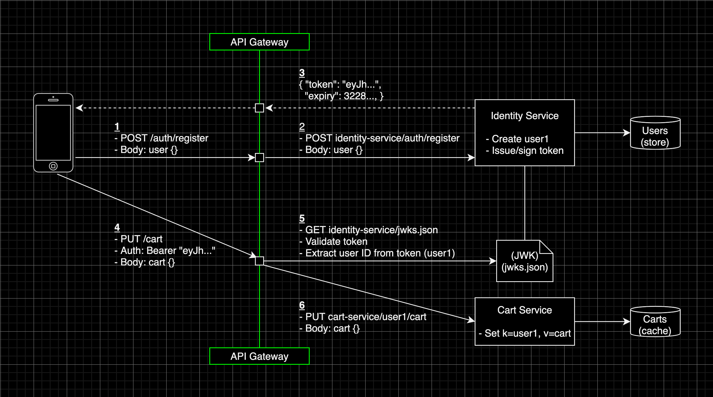

# API Gateways Article Code
Example code from the ["API Gateways: Maintainability in the Face of API Complexity"](https://fabijan-bajo.medium.com/) article.



| Service                                    | Language    | Description                                                  |
| ------------------------------------------ | ----------- | ------------------------------------------------------------ |
| [gateway](./kubernetes-helmcharts/gateway)                   | Helm / Yaml | API Gateway that forwards clients to the micro-services, handles JWT validation, terminates tls and transforms url paths |
| [cart-service](./cart-service)         | Go          | Manages shopping carts for **registered** customers |
| [identity-service](./identity-service) | Typescript  | Manages customer accounts and signs JWTs (symmetric HMAC), while hosting a JSON Web Key set (JWK) to offload authorization to gateway |

### Prerequisites
* [Docker](https://www.docker.com/)
* [Skaffold](https://skaffold.dev/) (Kubernetes only)

### Deploy

Clone this repository
```sh
git clone git@github.com:Bajocode/article-apigateways.git
cd article-apigateways
```

###### Kubernetes Local Docker Desktop
> Ensure Docker and Skaffold are installed

1. Enable Kubernetes on [Docker Desktop](https://docs.docker.com/docker-for-mac/#kubernetes)
2. Deploy
```sh
skaffold run --port-forward=user
```
wait and verify all helmcharts have been deployed
```
kubectl get pods

NAME                                READY   STATUS    RESTARTS   AGE
cart-service-7b9695d479-s2r4t       1/1     Running   0          8m1s
gateway-87cf57767-47qnc             1/1     Running   0          7m34s
identity-service-567685c7b6-mcx68   1/1     Running   0          7m52s
```
3. The gateway is automatically exposed by skaffold at `0.0.0.0:8080`. To do it manually:
```sh
kubectl port-forward deployment/gateway 8080
```
4. Destroy (optional)
```sh
skaffold delete
```

###### Docker Compose
> Ensure Docker and Docker Compose are installed

1. Deploy
```sh
docker compose up
```

2. Destroy (optional)
```sh
docker-compose down --rmi all
```
